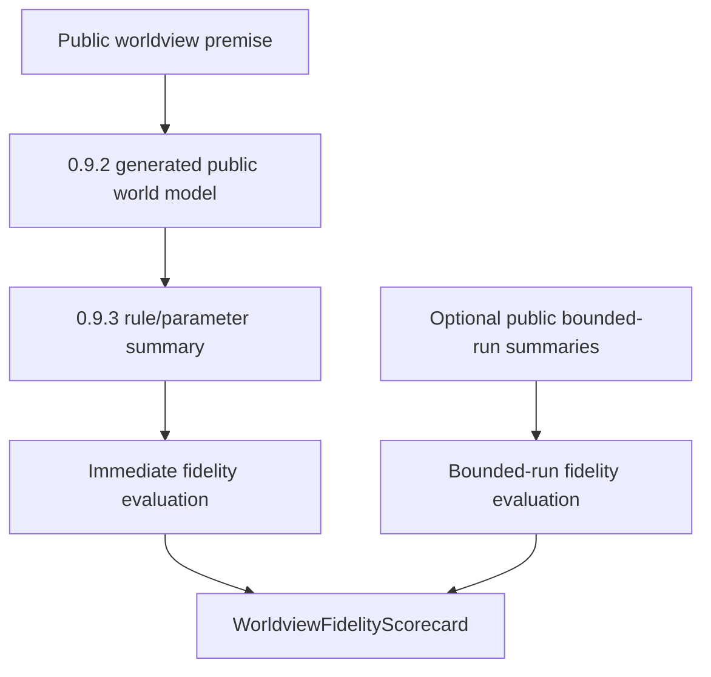

# Technical Design

Chinese mirror: `technical-design.zh.md`.

## Documentation And Implementation Structure

The implementation should be small and deterministic:

```text
backend/app/schemas/world_generation.py
backend/app/core/worldview_fidelity.py
backend/app/tests/test_worldview_fidelity_evaluation.py
```

No public API route is required for `0.9.4`. The helper should be importable by
later checker, API, or validation-run code without forcing those packages to
reuse private implementation details.

## Affected Files

`backend/app/schemas/world_generation.py`

- Add public additive fidelity models.
- Keep existing generation, provider, and rule-parameter models compatible.
- Forbid extra fields on new evidence models.

`backend/app/core/worldview_fidelity.py`

- Add pure helper functions:
  - `evaluate_immediate_worldview_fidelity(...)`
  - `evaluate_bounded_run_worldview_fidelity(...)`
  - `build_worldview_fidelity_scorecard(...)`
- The helpers consume already-public generated output, rule summaries, premise
  digests/tags, and optional public runtime summaries.

`backend/app/tests/test_worldview_fidelity_evaluation.py`

- Cover PASS, FAIL, BLOCKED, and redaction cases without live provider calls or
  generated result directories.

## Data / Control Flow



Immediate evaluation should:

- derive public premise indicators from the supplied premise or premise tags.
- compare them to generated public world model summaries and public rule
  references.
- fail when material public indicators are missing.
- block or fail deterministic generic fallback depending on whether the
  evaluator can inspect enough evidence.
- fail redaction if private markers appear in public evidence.

Bounded-run evaluation should:

- accept optional public runtime summaries only.
- report `blocked` when bounded-run evidence is missing.
- report `fail` for explicit contradiction records or runtime summaries that
  violate public premise indicators or boundaries.
- never run ticks or mutate state.

Scorecard construction should:

- return final `pass` only when immediate fidelity passes and bounded-run
  fidelity also passes using supplied public bounded-run evidence.
- report immediate-only success as a subsection result, not final package or
  lifecycle PASS.
- return `blocked` when required bounded-run evidence is unavailable because
  `0.9.5` controls are not implemented.
- return `not_run` when bounded-run evidence is intentionally omitted by an
  explicitly documented caller scope that is not claiming run-based fidelity.
- return `fail` for redaction, generic fallback marked as LLM-backed, missing
  premise coverage, or explicit contradiction.

## Compatibility Strategy

- New schemas are additive.
- Existing route payloads do not gain required fields.
- Existing fallback labels remain unchanged.
- Helpers accept model instances or public dictionaries only if the test plan
  proves no raw private fields are echoed.
- Diagnostics and contradictions must report code/category/path/summary without
  echoing secret-like or private input values.

## Anti-drift Rules

- Do not make fidelity PASS depend on subjective prose.
- Do not create concrete validation-world fixture content.
- Do not treat deterministic fallback as premise-faithful LLM output.
- Do not pre-implement `0.9.5` run controls.
- Do not convert blocked or not-run run-based fidelity into final pass just
  because immediate generation fidelity passes.
