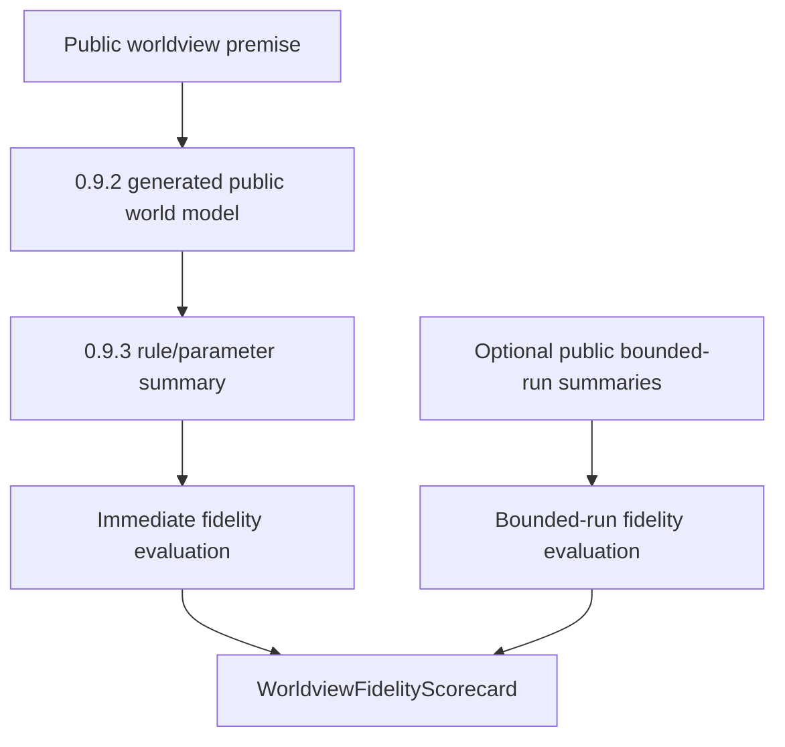

# Technical Design

英文原文：`technical-design.md`。

## 文档与实现结构

实现应保持小而 deterministic：

```text
backend/app/schemas/world_generation.py
backend/app/core/worldview_fidelity.py
backend/app/tests/test_worldview_fidelity_evaluation.py
```

`0.9.4` 不要求新增 public API route。Helper 应可被后续 checker、API 或 validation-run
code 导入，但不强迫后续包复用 private implementation details。

## 受影响文件

`backend/app/schemas/world_generation.py`

- 添加 public additive fidelity models。
- 保持既有 generation、provider 和 rule-parameter models compatible。
- 新 evidence models 禁止 extra fields。

`backend/app/core/worldview_fidelity.py`

- 添加 pure helper functions：
  - `evaluate_immediate_worldview_fidelity(...)`
  - `evaluate_bounded_run_worldview_fidelity(...)`
  - `build_worldview_fidelity_scorecard(...)`
- Helpers 消费已经公开的 generated output、rule summaries、premise digests/tags
  和可选 public runtime summaries。

`backend/app/tests/test_worldview_fidelity_evaluation.py`

- 在不调用 live provider、也不创建 generated result directories 的前提下覆盖 PASS、FAIL、
  BLOCKED 和 redaction cases。

## 数据 / 控制流



Immediate evaluation 应该：

- 从 supplied premise 或 premise tags 派生 public premise indicators。
- 将这些 indicators 与 generated public world model summaries 和 public rule references
  对照。
- 当 material public indicators 缺失时 fail。
- 根据 evaluator 是否有足够 evidence，对 deterministic generic fallback 进行 block 或 fail。
- 如果 public evidence 出现 private markers，则 redaction fail。

Bounded-run evaluation 应该：

- 只接受 optional public runtime summaries。
- 当 bounded-run evidence 缺失时报告 `blocked`。
- 如果存在 explicit contradiction records，或 runtime summaries 违反 public premise
  indicators/boundaries，则报告 `fail`。
- 永不运行 ticks 或 mutate state。

Scorecard construction 应该：

- 只有 immediate fidelity pass 且 bounded-run fidelity 也基于 supplied public
  bounded-run evidence pass 时，final status 才返回 `pass`。
- immediate-only success 只能作为 subsection result，不能作为 final package 或 lifecycle PASS。
- 当 required bounded-run evidence 因 `0.9.5` controls 尚未实现而不可用时返回 `blocked`。
- 当 bounded-run evidence 因明确 documented caller scope 而有意省略，且调用方不声明
  run-based fidelity 时，返回 `not_run`。
- 对 redaction、generic fallback 被标记为 LLM-backed、missing premise coverage 或 explicit
  contradiction 返回 `fail`。

## 兼容策略

- New schemas 是 additive。
- Existing route payloads 不新增 required fields。
- Existing fallback labels 保持不变。
- Helpers 只接受 model instances 或 public dictionaries，并通过 test plan 证明不会 echo raw private fields。
- Diagnostics 和 contradictions 必须报告 code/category/path/summary，不得 echo secret-like 或 private input values。

## 防漂移规则

- 不让 fidelity PASS 依赖 subjective prose。
- 不创建 concrete validation-world fixture content。
- 不把 deterministic fallback 当作 premise-faithful LLM output。
- 不提前实现 `0.9.5` run controls。
- 不因为 immediate generation fidelity pass 就把 blocked 或 not-run run-based fidelity
  改成 final pass。
