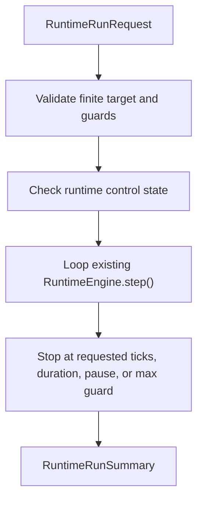

# Technical Design

Chinese mirror: `technical-design.zh.md`.

## Documentation And Implementation Structure

Implementation should stay in the active backend runtime path:

```text
backend/app/schemas/runtime.py
backend/app/core/runtime_engine.py
backend/app/api/routes/runtime.py
backend/app/tests/test_runtime_bounded_run.py
backend/app/tests/test_runtime_step.py
```

If the repository prefers colocating route-local response models in
`runtime.py`, implementation may keep existing response models there and add a
small schema file only for reusable request/summary models.

## Affected Files

`backend/app/core/runtime_engine.py`

- Add in-memory control state: idle, running, paused.
- Add pause/resume methods.
- Add bounded run method that loops over existing `step()` up to finite guards.
- Preserve existing `step()` behavior for one-tick compatibility.

`backend/app/api/routes/runtime.py`

- Add `POST /runtime/run`.
- Add `POST /runtime/pause`.
- Add `POST /runtime/resume`.
- Return public API envelopes using existing `ApiResponse`.

`backend/app/tests/test_runtime_bounded_run.py`

- Cover helper and API behavior.

## Data / Control Flow



The bounded run helper should:

- reject requests without `ticks` or `duration_seconds`.
- reject requests that include both `ticks` and `duration_seconds`.
- reject requests where target values exceed max guards.
- run only by repeatedly calling the existing `step()` method.
- stop before any unbounded loop can occur.
- set control state to `running` only during synchronous bounded execution.
- restore control state to `idle` after a completed run.
- return `blocked` when paused.
- include provider-call and cost counters as zero.

Pause/resume should:

- be explicit public controls.
- keep `pause` state in memory only.
- not create background scheduling semantics.
- allow `resume` to return to idle so the next bounded run may start.

## Compatibility Strategy

- Existing `step()` remains the primitive single-step operation.
- Existing `/runtime/step` and `/runtime/state` remain compatible.
- Bounded run emits the same normal tick events and archive callbacks by using
  `step()`.
- New fields are additive and live only on new endpoints/schemas.

## Anti-drift Rules

- Do not implement durable scheduler behavior.
- Do not let an omitted target imply "run forever".
- Do not call providers or estimate real provider costs.
- Do not treat this package as proof of rule-linked evolution or event
  legality.
- Do not change `backend/worldengine/`.

