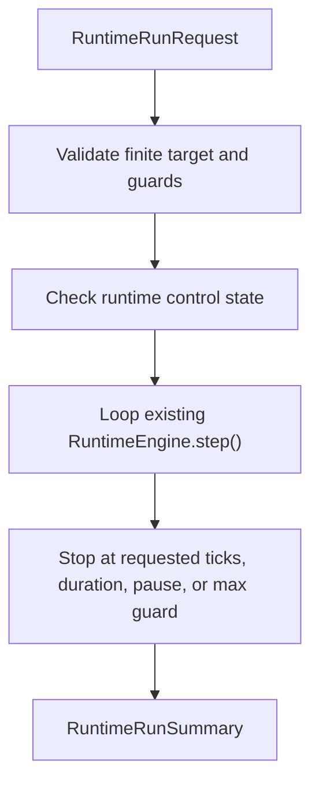

# Technical Design

英文原文：`technical-design.md`。

## 文档与实现结构

Implementation 应留在 active backend runtime path：

```text
backend/app/schemas/runtime.py
backend/app/core/runtime_engine.py
backend/app/api/routes/runtime.py
backend/app/tests/test_runtime_bounded_run.py
backend/app/tests/test_runtime_step.py
```

如果仓库更倾向把 route-local response models 放在 `runtime.py` 中，implementation 可以保留
existing response models，并只为 reusable request/summary models 添加小型 schema file。

## 受影响文件

`backend/app/core/runtime_engine.py`

- 添加 in-memory control state：idle、running、paused。
- 添加 pause/resume methods。
- 添加 bounded run method，通过有限 guard 循环调用 existing `step()`。
- 保持 existing `step()` behavior 作为 one-tick compatibility。

`backend/app/api/routes/runtime.py`

- 添加 `POST /runtime/run`。
- 添加 `POST /runtime/pause`。
- 添加 `POST /runtime/resume`。
- 使用 existing `ApiResponse` 返回 public API envelopes。

`backend/app/tests/test_runtime_bounded_run.py`

- 覆盖 helper 和 API behavior。

## 数据 / 控制流



Bounded run helper 应该：

- 拒绝没有 `ticks` 或 `duration_seconds` 的 request。
- 拒绝同时包含 `ticks` 和 `duration_seconds` 的 request。
- 拒绝 target values 超过 max guards 的 request。
- 只通过重复调用 existing `step()` 来运行。
- 在任何 unbounded loop 出现前停止。
- 只在 synchronous bounded execution 期间把 control state 设为 `running`。
- completed run 后恢复 control state 为 `idle`。
- paused 时返回 `blocked`。
- provider-call 和 cost counters 保持为零。

Pause/resume 应该：

- 是明确的 public controls。
- 只在内存中保存 `pause` state。
- 不创建 background scheduling semantics。
- 允许 `resume` 返回 idle，使下一次 bounded run 可以开始。

## 兼容策略

- Existing `step()` 仍是 primitive single-step operation。
- Existing `/runtime/step` 和 `/runtime/state` 保持 compatible。
- Bounded run 通过调用 `step()` 产生正常 tick events 和 archive callbacks。
- New fields 是 additive，且只存在于 new endpoints/schemas。

## 防漂移规则

- 不实现 durable scheduler behavior。
- 不让 omitted target 表示 “run forever”。
- 不调用 providers，也不估算真实 provider costs。
- 不把本包当作 rule-linked evolution 或 event legality 的证明。
- 不修改 `backend/worldengine/`。

