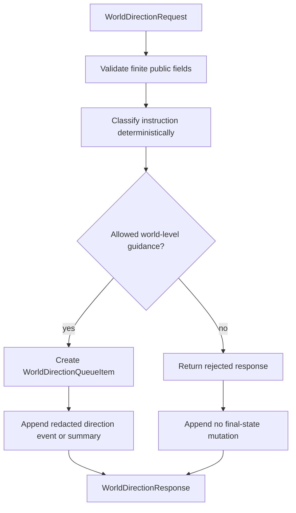

# Technical Design

Chinese mirror: `technical-design.zh.md`.

## Documentation And Implementation Structure

Implementation should stay in the active backend world API path:

```text
backend/app/schemas/world_direction.py
backend/app/api/routes/world.py
backend/app/tests/test_world_direction_boundary.py
backend/app/tests/test_public_handoff_contract_api.py
```

If the repository prefers keeping small public world schemas in
`backend/app/schemas/world.py`, implementation may place additive direction
models there. The implementation must not add runtime features under
`backend/worldengine/`.

## Affected Files

`backend/app/schemas/world_direction.py` or `backend/app/schemas/world.py`

- Add request, classification, queue item, response, and summary models.
- Reject extra fields.
- Use public enum values for allowed categories, forbidden categories, status,
  rejection reason, redaction status, and timing status.

`backend/app/api/routes/world.py`

- Add a canonical direction submission helper or endpoint.
- Preserve compatibility for `/worlds/{world_id}/director-guidance`.
- Avoid echoing raw direction text into public event payloads.
- Emit only redacted public summaries, text length, public context keys,
  classification, queue id, and timing fields.

`backend/app/tests/test_world_direction_boundary.py`

- Cover helper and API behavior for allowed and forbidden direction.

`backend/app/tests/test_public_handoff_contract_api.py`

- Keep existing public director guidance behavior and redaction coverage
  passing.

## Data / Control Flow



The direction helper should:

- accept benign environment trend, risk, pressure, probability, rule
  constraint, or future evaluation guidance.
- reject direct final facts and direct Agent private mutations.
- reject attempts to set Agent goals, memory, relationships, inventory,
  life/death state, location teleportation, or impossible final outcomes.
- reject obvious rule bypass wording such as "ignore rules" or "force
  outcome" as public `rule_bypass`.
- mark private markers as `private_marker_detected` and avoid public echo.
- bound timing by non-negative ticks and reject `expires_after_tick` values
  earlier than `apply_after_tick`.
- return queued guidance without applying canonical world-state changes.

## Compatibility Strategy

- Existing benign `/worlds/{world_id}/director-guidance` calls must still return
  a public accepted-compatible response.
- The compatibility path may internally call the new direction classifier, but
  it must preserve existing response fields used by current tests.
- Existing event listing remains public and redacted.
- New schema fields are additive.
- Bounded runtime controls from `0.9.5` are not changed; this package may only
  reference ticks for timing windows.

## Anti-drift Rules

- Do not implement final event legality or rule adjudication; queue only.
- Do not create provider-backed interpretation.
- Do not convert user direction into player action or content injection.
- Do not mutate Agent private state, Agent memory, Agent goals, or final facts.
- Do not leak raw prompt, raw provider response, hidden context, private
  memory, private goal, or private evaluator data.
- Do not change `backend/worldengine/`.
