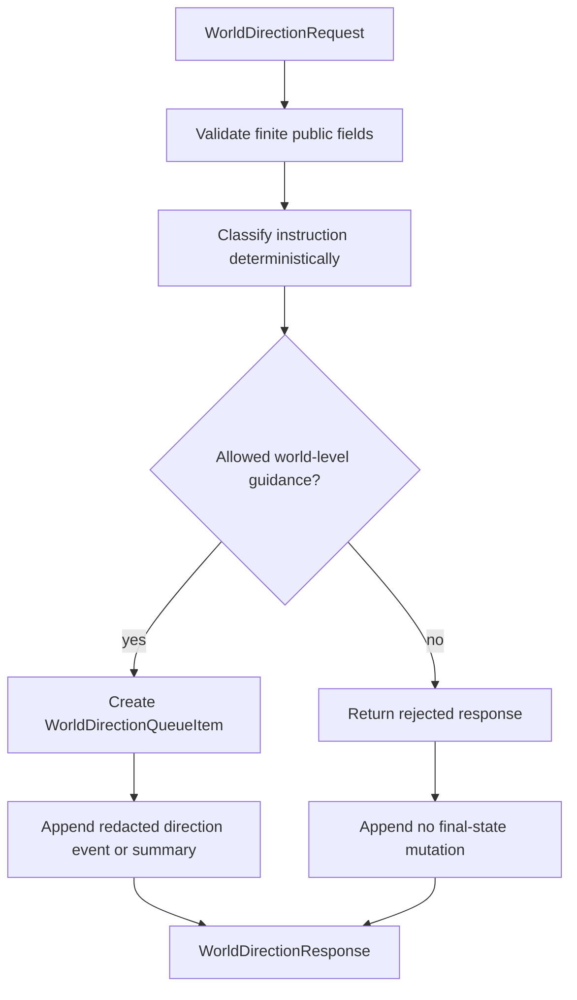

# Technical Design

英文原文：`technical-design.md`。

## Documentation And Implementation Structure

Implementation 应留在 active backend world API path：

```text
backend/app/schemas/world_direction.py
backend/app/api/routes/world.py
backend/app/tests/test_world_direction_boundary.py
backend/app/tests/test_public_handoff_contract_api.py
```

如果仓库更倾向把小型 public world schemas 留在 `backend/app/schemas/world.py`，implementation
可以把 additive direction models 放在那里。Implementation 不得在 `backend/worldengine/`
下新增 runtime features。

## 受影响文件

`backend/app/schemas/world_direction.py` 或 `backend/app/schemas/world.py`

- 增加 request、classification、queue item、response 和 summary models。
- Reject extra fields。
- 为 allowed categories、forbidden categories、status、rejection reason、redaction status
  和 timing status 使用 public enum values。

`backend/app/api/routes/world.py`

- 增加 canonical direction submission helper 或 endpoint。
- 保持 `/worlds/{world_id}/director-guidance` compatibility。
- 避免把 raw direction text echo 到 public event payloads。
- 只 emit redacted public summaries、text length、public context keys、classification、
  queue id 和 timing fields。

`backend/app/tests/test_world_direction_boundary.py`

- 覆盖 allowed 和 forbidden direction 的 helper/API behavior。

`backend/app/tests/test_public_handoff_contract_api.py`

- 保持 existing public director guidance behavior 和 redaction coverage passing。

## Data / Control Flow



Direction helper 应该：

- 接受 benign environment trend、risk、pressure、probability、rule constraint 或 future
  evaluation guidance。
- 拒绝 direct final facts 和 direct Agent private mutations。
- 拒绝设置 Agent goals、memory、relationships、inventory、life/death state、location
  teleportation 或 impossible final outcomes 的尝试。
- 把明显 rule bypass wording，例如 "ignore rules" 或 "force outcome"，标为 public
  `rule_bypass`。
- 把 private markers 标为 `private_marker_detected`，并避免 public echo。
- 通过 non-negative ticks 限定 timing；拒绝早于 `apply_after_tick` 的
  `expires_after_tick`。
- 返回 queued guidance，不应用 canonical world-state changes。

## Compatibility Strategy

- 既有 benign `/worlds/{world_id}/director-guidance` calls 必须仍返回 public
  accepted-compatible response。
- Compatibility path 可以内部调用新的 direction classifier，但必须保留当前 tests 使用的
  existing response fields。
- Existing event listing 保持 public and redacted。
- New schema fields additive。
- 不修改 `0.9.5` bounded runtime controls；本包只能引用 ticks 作为 timing windows。

## Anti-drift Rules

- 不实现 final event legality 或 rule adjudication；只 queue。
- 不创建 provider-backed interpretation。
- 不把 user direction 转成 player action 或 content injection。
- 不 mutate Agent private state、Agent memory、Agent goals 或 final facts。
- 不泄露 raw prompt、raw provider response、hidden context、private memory、private goal 或
  private evaluator data。
- 不修改 `backend/worldengine/`。
