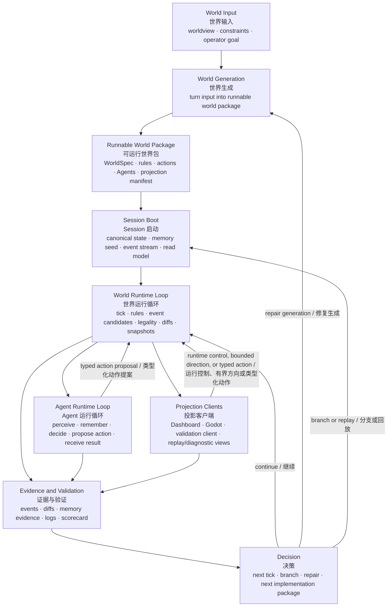
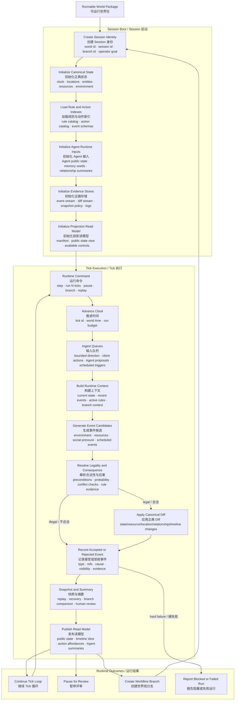

# WorldEngine Living World Development Flow

Status: target development-flow alignment draft

Chinese mirror: `docs/living-world-development-flow.zh.md`.

This document describes the development-readable flow needed for WorldEngine to
complete the real product loop:

```text
World Generation -> World Runtime -> Agent Runtime -> projection/evidence -> next tick or next decision
```

It intentionally does not treat the current codebase as the source of truth.
The purpose is to align the target behavior before deciding the next
implementation package.

## 0. Big Framework

This is the small version to review first. If this does not feel right, the
module-level details below should not be implemented yet.



### Big Framework Node Explanations

| Node | Plain-language role | Output or decision point |
| --- | --- | --- |
| World Input / 世界输入 | First, state what kind of world is needed and what this run is meant to prove. This is direction and boundary setting, not detailed generation. | Worldview, constraints, operator goal. |
| World Generation / 世界生成 | Turn that direction into a runnable world package: places, people, items, rules, actions, initial Agent state, and data that projection clients can read. | Draft runnable world package. |
| Runnable World Package / 可运行世界包 | The handoff that turns a setting into something that can boot. It is not the Godot map itself; it is a data package WorldEngine, Dashboard, Godot, and validation clients can all understand. | WorldSpec, RuleCatalog, ActionCatalog, AgentSeedSet, ProjectionManifest. |
| Session Boot / Session 启动 | Start a real run from the package: create the session and initialize timeline, world state, Agent memory seed, event stream, and projection read model. | A ready world session. |
| World Runtime Loop / 世界运行循环 | Let the world pass time. Each tick handles external direction, game-engine feedback, rule triggers, event candidates, legality checks, diffs, and snapshots. | New events, state changes, snapshots, next tick. |
| Agent Runtime Loop / Agent 运行循环 | Let Agents perceive, remember, decide whether to act, and submit action requests. Agents do not directly mutate the world; WorldEngine adjudicates the result. | Perception frame, intent, ActionRequest, ActionResult, memory evidence. |
| Projection Clients / 投影客户端 | Dashboard, Godot, validation clients, and replay/diagnostic views show WorldEngine's public state and send back important user or engine operations. Godot owns concrete visuals, collision, animation, and feel. | Visualization, operation input, feedback events. |
| Evidence and Validation / 证据与验证 | Record what happened in the run so humans or checkers can decide whether the world really ran and whether Agents really experienced those events. | Events, diffs, snapshots, Agent evidence, logs, scorecard. |
| Decision / 决策 | Use the evidence to decide the next step: keep running, repair generation, branch/replay, or choose the next implementation package. | Next tick, repair, branch, next package. |

One-line reading: input sets the world's direction; generation produces a
runnable package; session boot turns the package into a running world; the
runtime loop advances time; the Agent loop lets inhabitants perceive and act;
projection clients show the world and return important feedback; evidence
proves what happened; the decision node chooses the next step.

Godot is not the core chain's "physical truth." It sits in the projection
client and feedback-event layer: it renders scenes, handles local interaction,
and reports historically meaningful results back to WorldEngine.

## 1. World Generation Detail

Goal: turn a user/world brief into a runnable world package that the runtime
can actually load and operate.

### Parameter Granularity Rule

The hard part of world generation is not producing a large amount of lore. It
is producing parameters that are detailed enough to support the runtime loop.
A parameter set is sufficient only if it can answer these runtime questions:

| Runtime question | Required granularity |
| --- | --- |
| What exists in the world? | At minimum, stable `location_id`, `entity_id`, `agent_id`, `resource_id`, and `rule_id` references. |
| Where is everything? | WorldEngine tracks at least region/room/node/slot location. Godot may own tile/grid/pixel coordinates and sync them only when they affect canonical outcomes. |
| What can change? | Every mutable state needs a field, type, range, default value, and mutation rule. |
| Why can it change? | Each change class must trace to a rule, action, trigger, probability, or external pressure. |
| What can an Agent perceive? | Visibility, distance/area, public state, recent events, and available actions. |
| What can an Agent do? | Action type, target constraints, preconditions, cost, consequences, and failure reasons. |
| What can a client render? | Public read model, sprite/prefab key, scene/area hints, interaction points, and state-to-visual mapping. Precise motion and collision presentation can stay local to the game engine. |
| How is the run reviewed? | Events, diffs, snapshots, Agent memory evidence, client operation logs, and classification criteria. |

The first version does not need every animation frame, every pixel, or every
NPC's full inner life. It needs enough structure to support:

```text
generate world -> initialize session -> advance tick -> produce events/state changes -> Agent perceives and acts -> Godot/Dashboard sees the same change
```

For a simple Godot pixel-art or 2D/2.5D client, split data into four layers:

| Layer | Canonical in WorldEngine? | Example data | Purpose |
| --- | --- | --- | --- |
| WorldEngine canonical layer | Yes | world seed, timeline, location graph, abstract entity/item/Agent state, rules, actions, events, Agent memory summaries and self-continuity | Maintains world facts, history direction, event causality, and Agent self. |
| Projection contract layer | Public contract, not physics simulation | sprite/prefab key, scene/area id, interaction hotspot, public-state-to-visual-state mapping | Lets Godot know what to show and what can be interacted with. |
| Game-engine local layer | No | tilemap, collision bodies, Rigidbody/Area, pathfinding, animation, particles, camera, game feel, frame-level coordinates | Godot owns concrete physics, rendering, and immediate interaction feel. |
| Feedback event layer | Canonical only after acceptance | arrived at area, interaction succeeded/failed, collision blocked path, item picked up/broken, trigger fired, combat/damage result | Godot reports historically meaningful results to WorldEngine; WorldEngine decides whether to write events/diffs. |

The more accurate relationship is not "WorldEngine replaces the game engine."
It is:

```text
WorldEngine produces world facts, history, rules, Agent state, and projection contracts
-> Godot renders and simulates the concrete scene from those data
-> Godot reports canonically meaningful interaction results back to WorldEngine
-> WorldEngine updates events, timeline, world state, and Agent self
```

WorldEngine does not need to store the full Godot scene tree, control every
animation frame, or perform fine-grained physics simulation. WorldEngine needs
to emit:

```text
who this entity is
which location/area/slot it occupies
which public state it has now
who can see it
which interactions it exposes
which rules or feedback events decide canonical results
which events, diffs, and projection state the result produces
```

Recommended minimum first-stage granularity:

| Category | Minimum runnable granularity |
| --- | --- |
| Space | `location_id` plus graph connections and area/slot. Godot may own tile/grid/pathfinding locally; only area changes or significant position changes need to sync back. |
| Entity | `entity_id` plus `kind`, `location_id`, public state, and tags. |
| Item | `item_id`, location/holder, item type, interaction state, and canonically relevant traits. |
| Abstract physical/interaction constraints | Only constraints that affect history, events, action results, or Agent decisions, such as `weight_class`, `portable/anchored`, `fragile/durable`, `blocks_path`, and `container_capacity`. Concrete collision shapes and motion belong to the game engine. |
| Agent | `agent_id`, location, needs/goals, available actions, public memory summary, and relationship summary. |
| Resource | resource id, value/state, owner entity or location, and mutation rules. |
| Rule | trigger/condition, consequence, evidence fields, cooldown/probability. |
| Action | action type, target refs, preconditions, effects, and failure reasons. |
| Event | event type, refs, cause, visibility, importance, and applied/rejected diff. |
| Projection | sprite/prefab key, scene/area hints, state-to-visual mapping, and interaction hotspot. Precise coordinates/layers can remain local to the game engine. |

This means the first living-world slice can start at room/region granularity.
Godot can render the same room as a tilemap, 2.5D scene, or pixel-art map, but
WorldEngine does not need to know every tile's physical details. Sync a
position, collision, or interaction result back only when it changes history,
event records, item state, or Agent memory.

Items and physical traits should be included, but as constraints that matter to
world history. For example, "the crate is too heavy for this Agent to move",
"the locked door makes entry fail", or "the glass broke and changed the room
state." Godot may own collision shapes, animation, particles, frame-level
motion, and game feel. Those details become WorldEngine events or diffs only
when they become canonical events such as "the door was forced open", "the
character fell and was injured", or "the item broke."

```mermaid
flowchart TD
  subgraph INPUT["Generation Input / 生成输入"]
    GI0["World Brief<br/>世界简述<br/>worldview · genre · tone · scale · premise"]
    GI1["Constraints<br/>约束<br/>allowed scope · safety policy · cost budget · generic-core boundary"]
    GI2["Operator Goal<br/>操作者目标<br/>debug · validation · story exploration · replay comparison"]
  end

  subgraph PLAN["World Planning / 世界规划"]
    GP0["Clarify Missing Assumptions<br/>补齐缺失假设<br/>time scale · spatial scale · entity density · interaction depth"]
    GP1["Ontology Plan<br/>本体规划<br/>locations · entities · resources · factions · timelines · child-world hooks"]
    GP2["Rule Plan<br/>规则规划<br/>time · movement · resource · social · environmental · event legality"]
    GP3["Action Catalog Plan<br/>动作目录规划<br/>who can do what · target refs · preconditions · consequences"]
    GP4["Agent Seed Plan<br/>Agent 种子规划<br/>identity · needs · goals · relationships · memory seeds"]
    GP5["Projection Plan<br/>投影规划<br/>what clients can see · available controls · debug overlays"]
  end

  subgraph BUILD["World Package Build / 世界包构建"]
    GB0["Compile WorldSpec<br/>编译 WorldSpec<br/>structured cells · refs · initial state · metadata"]
    GB1["Compile Rule Catalog<br/>编译规则目录<br/>rule ids · conditions · consequences · evidence fields"]
    GB2["Compile Action Catalog<br/>编译动作目录<br/>typed action schemas · legality checks · result shapes"]
    GB3["Compile AgentSeedSet<br/>编译 Agent 种子集<br/>public state · memory seed refs · goal/need defaults"]
    GB4["Compile ProjectionManifest<br/>编译投影清单<br/>read model fields · client controls · redaction policy"]
    GB5["Compile EvidencePolicy<br/>编译证据策略<br/>events · diffs · snapshots · memory evidence · validation logs"]
  end

  subgraph GATE["Generation Gates / 生成门禁"]
    GG0["Schema Gate<br/>Schema 门禁<br/>JSON-compatible · refs resolvable · bounded recursion"]
    GG1["Runtime Readiness Gate<br/>运行就绪门禁<br/>can initialize state · rules have targets · actions have handlers"]
    GG2["Agent Readiness Gate<br/>Agent 就绪门禁<br/>agents can perceive, choose no-intent, or submit valid actions"]
    GG3["Projection Readiness Gate<br/>投影就绪门禁<br/>clients can render/read without private data or hidden mutation"]
    GG4["Preview Review<br/>预览评审<br/>human can inspect assumptions, risks, and generated structure"]
  end

  GW0["Runnable World Package<br/>可运行世界包<br/>WorldSpec + RuleCatalog + ActionCatalog + AgentSeedSet + ProjectionManifest + EvidencePolicy"]

  GI0 --> GP0
  GI1 --> GP0
  GI2 --> GP0
  GP0 --> GP1
  GP1 --> GP2
  GP2 --> GP3
  GP3 --> GP4
  GP4 --> GP5
  GP5 --> GB0
  GB0 --> GB1
  GB1 --> GB2
  GB2 --> GB3
  GB3 --> GB4
  GB4 --> GB5
  GB5 --> GG0
  GG0 --> GG1
  GG1 --> GG2
  GG2 --> GG3
  GG3 --> GG4
  GG4 -->|"approved / 通过"| GW0
  GG0 -->|"repair / 修复"| GP1
  GG1 -->|"repair / 修复"| GP2
  GG2 -->|"repair / 修复"| GP4
  GG3 -->|"repair / 修复"| GP5
```



Development contract:

| Output | Must answer |
| --- | --- |
| `WorldSpec` | What exists at session start? |
| `RuleCatalog` | Why can the world change? |
| `ActionCatalog` | What can operators or Agents ask the world to do? |
| `AgentSeedSet` | Who lives in the world, and what public state/memory begins with them? |
| `ProjectionManifest` | What can Dashboard, Godot, and validation clients read or operate? |
| `EvidencePolicy` | What must be recorded so the run is inspectable? |

## 2. World Runtime Detail

Goal: run a world package as canonical state over time, with every accepted or
rejected change passing through rules, events, diffs, and evidence.



Development contract:

| Boundary | Required rule |
| --- | --- |
| Direction input | External direction can create pressure or constraints, not final facts. |
| Client action | A client action becomes a typed request, not direct state mutation. |
| Agent action | Agent proposes; WorldEngine decides legality and consequences. |
| State mutation | Every mutation must be an applied diff linked to an event. |
| Rejection | Rejected events/actions are recorded, not silently dropped. |
| Projection | Clients read a public read model, not private canonical internals. |

### User Direction and World Trajectory Control

WorldEngine should let users influence the world's trajectory to a bounded
degree, but this is not an instant "god hand" that rewrites the world.
User intervention should be modeled as `BoundedDirection`,
`OperatorIntervention`, or candidate world events that enter runtime queues and
are then adjudicated through rules, causality, and physical plausibility.

User insertion points should be explicit windows, not arbitrary mid-frame state
mutation:

| Insertion point | What the user can influence | What still cannot be bypassed |
| --- | --- | --- |
| Before world generation | World theme, constraints, initial resources, social relationships, rule tendencies. | The generated world cannot be contradictory or unrunnable. |
| Before session boot | Initial branch, initial goal, scenario under review, observable scope. | Boot, rule indexes, evidence policy, and projection readiness cannot be skipped. |
| Tick boundary | Add pressure, goals, risks, candidate events, or external changes for the next run segment. | Final facts cannot be specified directly. For example, "this character immediately owns the key" must have an explainable path. |
| Review pause | Choose continue, repair generation, create branch, or replay based on evidence. | Existing canonical history cannot be overwritten; the system may only append explanation, repair the candidate world, or branch. |
| Worldline branch point | Explore another trajectory from a selected snapshot. | One worldline cannot contain mutually contradictory histories. |

Adjudication principles:

| Principle | Meaning |
| --- | --- |
| Direction is not fact | User input becomes pressure, constraint, candidate event, or goal bias first. It does not directly write canonical state. |
| Rules come first | Intervention must pass world rules, action preconditions, resource constraints, and conflict checks. |
| Physical plausibility comes first | Unless world rules explicitly allow magic, teleportation, or supernatural forces, spatial, weight, time, causality, visibility, and capability limits must hold. |
| Delay or translate when appropriate | If a direction is reasonable but cannot happen immediately, schedule it as a future event or translate it into more plausible intermediate events. |
| Rejection is valid | If an intervention violates rules or physical plausibility, WorldEngine should return rejected/blocked with recorded reasons. |
| Evidence is required | Record the original user direction, interpreted candidate event, adjudication basis, final accepted/rejected result, and applied diff. |
| Agents perceive in-world results | Agents may observe public consequences caused by intervention, but should not automatically know that an external user intervened. |

For example, if a user says "push the village into a food crisis faster,"
WorldEngine should not directly max out everyone's hunger state. A better
handling is to generate or schedule plausible causes: heavy rain delays
shipping, the granary is contaminated, a caravan fails to arrive, or prices
rise. Those events then advance through rules and affect resources, resident
behavior, and Agent memory.

If a user says "make this character immediately appear in the locked
basement," WorldEngine must check whether an explainable path exists: does the
character have a key, is there an entrance, does teleportation exist in the
world rules, or did another character bring them in? Without a plausible path,
the intervention should be rejected, delayed, or translated into "the character
tried to enter and failed."

### WorldEngine and Game-Engine Synchronization Model

WorldEngine should not synchronize with a game engine frame by frame. The game
engine can run at its own frame rate and own movement, collision, animation,
camera, particles, and feel. WorldEngine maintains historical truth: what
happened, which rules fired, how world state changed, and how Agents perceive,
think, decide, and remember those changes.

The recommended model is "event synchronization + timed summary
synchronization + critical action barriers":

| Synchronization mode | When it happens | What WorldEngine cares about | What the game engine still owns locally |
| --- | --- | --- | --- |
| Event synchronization | When something canonically meaningful happens, such as entering an area, picking up an item, opening a door, completing dialogue, dealing combat damage, or breaking an object. | Convert feedback into a `FeedbackEvent` or `ActionRequest`, adjudicate legality and consequences, and write event/diff/snapshot evidence. | Play animation, present collision, handle local pathing, and show visual feedback. |
| Timed summary synchronization | Periodically, such as every 1 second, every 5 seconds, or every N local frames. | Detect obvious drift between client and canon, update observable location/area, active-object summaries, client clock, and diagnostic evidence. | Keep frame-level coordinates, physics state, local navigation, and temporary visual state. |
| Critical action barrier | When the result changes history or Agent memory and must wait for adjudication, such as unlocking, trading, attacking, important dialogue choices, or item ownership changes. | Return accepted/rejected/modified plus `ActionResult`, applied diffs, and visible feedback. | Play success/failure presentation after the result returns; optionally play waiting or anticipation animation first. |
| Projection state publication | After WorldEngine accepts events or advances a tick. | Publish public read model, projection diff, available actions, and public Agent summaries. | Reconcile display from diffs without sending the full scene tree back to WorldEngine. |

The synchronization entry point belongs in `RT2 Ingest Queues`: client events,
Agent proposals, external direction, and timed summaries all enter queues first;
`RT5` adjudicates legality and consequences; `RT7` records acceptance or
rejection; `RT9` publishes the new public state. Timed synchronization is not a
way for WorldEngine to take ownership of every coordinate. It is for drift
detection, evidence, and weak consistency between world history and client
presentation.

The first stage can use conservative `lockstep QA mode`: critical actions wait
for WorldEngine responses, making generated rules and event closure easier to
validate. Product experience can later move to `realtime projection mode`:
ordinary movement, animation, and local collision run asynchronously; only
events, timed summaries, and critical barriers enter WorldEngine.

## 3. Agent Runtime Detail

Goal: make Agents live inside the world through perception, memory, intent,
action results, feedback, and continuity evidence without becoming generic chat
wrappers or hidden state mutators.

```mermaid
flowchart TD
  RA0["Runtime Schedules Agent<br/>运行时调度 Agent<br/>tick window · event trigger · rest window · validation request"]

  subgraph PERCEPTION["Perception / 感知"]
    AP0["Build Perception Frame<br/>构建感知帧<br/>visible state · nearby entities · recent events · available actions"]
    AP1["Attach Public World Context<br/>附加公开世界上下文<br/>rules summary · location context · environment state"]
    AP2["Retrieve Bounded Memory<br/>检索有界记忆<br/>working memory · episodic memory · relationships · prior feedback"]
  end

  subgraph DECISION["Decision / 决策"]
    AD0["Evaluate Internal Public State<br/>评估公开内部状态<br/>needs · goals · status · stress · uncertainty"]
    AD1["Choose Intent Mode<br/>选择意图模式<br/>act · observe · no-intent · rest · sleep"]
    AD2["Prepare Typed Action<br/>准备类型化动作<br/>action type · target refs · parameters · expected effect"]
    AD3["Action Adapter<br/>动作适配器<br/>normalize proposal to runtime action contract"]
  end

  subgraph RESOLUTION["Resolution / 判定"]
    AR0["Submit to Runtime Resolver<br/>提交运行时解析器<br/>WorldEngine checks legality and consequence"]
    AR1["Receive Action Result<br/>接收动作结果<br/>success · failure · partial · blocked · world response"]
    AR2["Update Public Agent State<br/>更新公开 Agent 状态<br/>location · needs · goal progress · relationship signals"]
  end

  subgraph MEMORY["Memory and Continuity / 记忆与连续性"]
    AM0["Write Experience Evidence<br/>写入经验记录<br/>event refs · action result refs · public summary"]
    AM1["Update Working Memory<br/>更新工作记忆<br/>current concerns · recent facts · short-horizon goals"]
    AM2["Update Episodic Memory<br/>更新情节记忆<br/>bounded record · provenance · emotional/feedback tags"]
    AM3["Rest or Sleep Consolidation<br/>休息或睡眠巩固<br/>memory summary · relationship summary · personality drift signal"]
    AM4["Agent Continuity Evidence<br/>Agent 连续性证据<br/>perception · intent · result · memory/consolidation delta"]
  end

  RA0 --> AP0
  AP0 --> AP1
  AP1 --> AP2
  AP2 --> AD0
  AD0 --> AD1
  AD1 -->|"act / 行动"| AD2
  AD1 -->|"observe or no-intent / 观察或无行动"| AM0
  AD1 -->|"rest or sleep / 休息或睡眠"| AM3
  AD2 --> AD3
  AD3 --> AR0
  AR0 --> AR1
  AR1 --> AR2
  AR2 --> AM0
  AM0 --> AM1
  AM1 --> AM2
  AM2 --> AM3
  AM3 --> AM4
```



Development contract:

| Agent step | Required output |
| --- | --- |
| Perception | What the Agent publicly saw and could act on. |
| Memory retrieval | Which bounded memory summaries influenced the step. |
| Intent mode | Whether the Agent acted, observed, rested, slept, or did nothing. |
| Action proposal | A typed request with target refs and expected effect. |
| Runtime result | WorldEngine-owned legality and consequence result. |
| Continuity evidence | Inspectable public evidence that the Agent changed or stayed stable for a reason. |

## 4. Cross-Module Interfaces

These interfaces are the points where the three modules must connect. If any
one is vague, the product will feel like separate pieces rather than a living
world.

| Interface | Producer | Consumer | Purpose |
| --- | --- | --- | --- |
| `RunnableWorldPackage` | World Generation | Session Boot / World Runtime | Carries the generated world into runtime. |
| `RuleCatalog` | World Generation | World Runtime | Explains why events and consequences can happen. |
| `ActionCatalog` | World Generation | Agent Runtime / Clients / Runtime | Defines legal action shapes and required result fields. |
| `ProjectionManifest` | World Generation | Dashboard / Godot / validation clients | Defines public read and operation surfaces. |
| `TickContext` | World Runtime | Rules / Agent Runtime | Gives each tick consistent state, events, and budgets. |
| `ActionRequest` | Agent Runtime / Clients | World Runtime | Requests a world mutation without directly mutating state. |
| `ActionResult` | World Runtime | Agent Runtime / Evidence | Returns legality, consequence, and feedback. |
| `AppliedDiff` | World Runtime | Projection / Evidence / Replay | Records exactly what changed. |
| `PublicAgentSummary` | Agent Runtime | Projection / Evidence | Shows Agent continuity without private payloads. |
| `EvidenceBundle` | Runtime / Agent / Client logs | Validation checker / human review | Supports pass/fail/blocked/not_run classification. |

## 5. What This Flow Should Prove

The first real product proof is not "all modules exist." It is this:

```text
Generate a small generic world.
Start a session from it.
Run ticks.
Let at least one Agent perceive, decide, and submit an action.
Let WorldEngine accept or reject that action through public rules.
Apply a canonical diff when accepted.
Record events, memory evidence, snapshots, and projection output.
Show the same run through Dashboard/Godot/validation surfaces.
Classify the result from public evidence.
```

If that loop works, WorldEngine is no longer only a good-looking framework. It
is a headless world runtime that can drive visible worlds.
