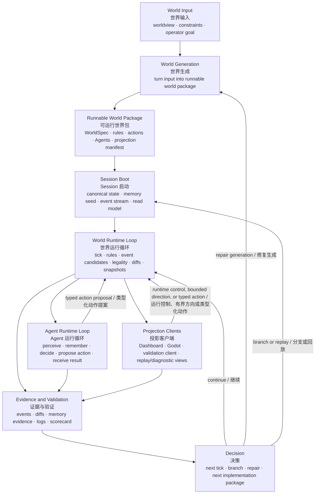
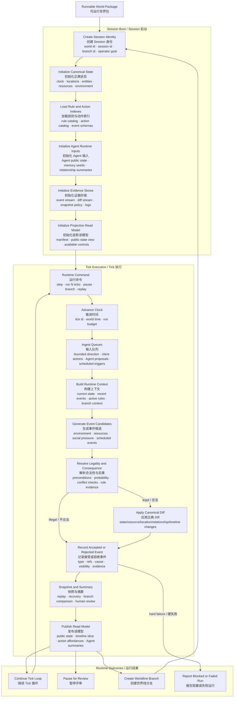

# WorldEngine 活世界开发流程图

状态：目标开发流程对齐稿

这份文档描述 WorldEngine 要真正完成产品闭环时，需要具备的开发级流程：

```text
世界生成 -> 世界运行 -> Agent 运行 -> 投影/证据 -> 下一 tick 或下一步决策
```

它**不以当前代码实现为准**。它的目的，是先对齐目标行为，再决定下一步应该进入哪个实现包。

英文版本：`docs/living-world-development-flow.md`。

## 0. 大框架

先看这张小总览。如果这张图本身不对，下面的模块细节就不应该进入实现。



### 大框架节点白话说明

| 节点 | 通俗说明 | 产出/判断点 |
| --- | --- | --- |
| World Input / 世界输入 | 先说清楚“要一个什么世界”，以及“这次跑它想验证什么”。这里不是生成细节，而是给方向和边界。 | 世界观、约束、操作者目标。 |
| World Generation / 世界生成 | 把方向翻译成一份可运行的世界包：有哪些地方、人、物品、规则、动作、Agent 初始状态，以及游戏引擎能读什么。 | 可运行世界包草案。 |
| Runnable World Package / 可运行世界包 | 世界从“设定”变成“可启动”的交接物。它不是 Godot 地图本身，而是 WorldEngine、Dashboard、Godot、验证客户端都能理解的数据包。 | WorldSpec、RuleCatalog、ActionCatalog、AgentSeedSet、ProjectionManifest。 |
| Session Boot / Session 启动 | 把世界包真正开成一次运行：建立 session，初始化时间线、世界状态、Agent 记忆种子、事件流和投影 read model。 | 一个 ready 的 world session。 |
| World Runtime Loop / 世界运行循环 | 世界开始过时间。每个 tick 处理外部方向、游戏引擎反馈、规则触发、事件候选、合法性判断、diff 和快照。 | 新事件、状态变化、快照、下一 tick。 |
| Agent Runtime Loop / Agent 运行循环 | Agent 在世界里感知、回忆、决定是否行动，然后提交动作请求。Agent 不直接改世界，WorldEngine 判定动作结果。 | 感知帧、意图、ActionRequest、ActionResult、记忆证据。 |
| Projection Clients / 投影客户端 | Dashboard、Godot、验证客户端等把 WorldEngine 的公开状态显示出来，也把用户或引擎里的重要操作反馈回来。Godot 负责具体画面、碰撞、动画和手感。 | 可视化、操作输入、反馈事件。 |
| Evidence and Validation / 证据与验证 | 把这一轮发生了什么记录清楚，让人或 checker 能判断世界是否真的跑起来、Agent 是否真的经历了这些事。 | events、diffs、snapshots、Agent evidence、logs、scorecard。 |
| Decision / 决策 | 根据证据决定下一步：继续跑、回到生成阶段修世界、开分支/回放，还是选择下一个实现包。 | next tick、repair、branch、next package。 |

一句话读法：输入决定世界方向；世界生成产出可运行包；Session 启动把包变成正在运行的世界；运行循环让世界随时间变化；Agent 循环让居民感知和行动；投影客户端把它显示给人看并反馈重要结果；证据层证明它真的发生；决策节点决定下一步。

这里的 Godot 不在核心链路里当“物理真相”，而是在投影客户端和反馈事件层：它显示场景、处理局部交互，把有历史意义的结果回传给 WorldEngine。

## 1. 世界生成细图

目标：把用户的世界简述变成运行时真正能加载、能运行、能被检查的世界包。

### 参数粒度原则

世界生成的难点不是“生成很多设定”，而是生成足够支撑运行时闭环的参数。判断参数是否足够，不看它像不像完整设定集，而看它能不能回答这些运行时问题：

| 运行时问题 | 参数需要细到什么程度 |
| --- | --- |
| 世界里有什么？ | 至少有可引用的 `location_id`、`entity_id`、`agent_id`、`resource_id`、`rule_id`。 |
| 东西在哪里？ | WorldEngine 至少记录区域/房间/节点/slot 级位置；tile/grid/像素坐标可以由 Godot 维护，只在影响正典结果时同步。 |
| 什么会变化？ | 每个可变状态都要有字段、类型、取值范围、默认值和修改规则。 |
| 为什么会变化？ | 每类变化都要能追到规则、动作、触发条件、概率或外部压力。 |
| Agent 能看见什么？ | 要有可见性、距离/区域、公开状态、近期事件、可用动作等感知输入。 |
| Agent 能做什么？ | 要有动作类型、目标约束、前置条件、成本、后果、失败原因。 |
| 客户端能显示什么？ | 要有公开 read model、sprite/prefab key、场景/区域提示、交互点、状态到视觉的映射；精确运动和碰撞表现可由游戏引擎本地处理。 |
| 这次运行怎么验收？ | 要有事件、diff、快照、Agent 记忆证据、客户端操作日志和分类标准。 |

所以第一版不需要把世界细到“每一帧动画、每个像素、每个 NPC 的完整内心”。它需要细到足以支撑：

```text
生成世界 -> 初始化 session -> 推进 tick -> 产生事件/状态变化 -> Agent 感知并行动 -> Godot/Dashboard 看见同一变化
```

以 Godot 简单像素风或 2D/2.5D 客户端为例，建议把数据分成四层：

| 层级 | 属于 WorldEngine 正典吗 | 示例数据 | 作用 |
| --- | --- | --- | --- |
| WorldEngine 正典层 | 是 | world seed、时间线、location graph、实体/物品/Agent 抽象状态、规则、动作、事件、Agent 记忆摘要与自我连续性 | 维护世界事实、历史走向、事件因果和 Agent 自我。 |
| 投影契约层 | 是公开契约，不是物理模拟 | sprite/prefab key、场景/区域 id、交互 hotspot、公开状态到视觉状态的映射 | 让 Godot 知道应该显示什么、哪些对象可交互。 |
| 游戏引擎本地层 | 否 | tilemap、碰撞体、RigidBody/Area、路径寻路、动画、粒子、camera、手感、帧级坐标 | Godot 负责具体物理、渲染和即时交互表现。 |
| 反馈事件层 | 只有被接受后才进入正典 | 到达区域、交互成功/失败、碰撞阻挡、物品被拾取/破坏、触发器触发、战斗/伤害结果 | Godot 把有历史意义的结果反馈给 WorldEngine，WorldEngine 决定是否写成事件/diff。 |

因此更准确的关系不是“WorldEngine 替代游戏引擎”，而是：

```text
WorldEngine 产生世界事实、历史、规则、Agent 状态和投影契约
-> Godot 根据这些数据呈现和模拟具体场景
-> Godot 把有正典意义的交互结果反馈给 WorldEngine
-> WorldEngine 更新事件、时间线、世界状态和 Agent 自我
```

WorldEngine 不需要保存 Godot 的完整场景树，也不需要控制每个动画帧或做精细物理模拟。WorldEngine 需要输出的是：

```text
这个实体是谁
它在哪个 location/area/slot
它现在是什么公开状态
它能被谁看见
它能触发哪些交互
如果发生动作，哪些规则或反馈事件决定正典结果
结果对应哪些事件、diff 和投影状态
```

第一阶段推荐的最低粒度：

| 类别 | 最低可运行粒度 |
| --- | --- |
| 空间 | `location_id` + 连接关系 + area/slot；Godot 可本地维护 tile/grid/pathfinding，只有区域变化或关键位置变化回写。 |
| 实体 | `entity_id` + `kind` + `location_id` + public state + tags。 |
| 物品 | `item_id` + 所在位置/持有者 + 物品类型 + 可交互状态 + 正典相关属性。 |
| 抽象物理/交互约束 | 只记录会影响历史、事件、动作结果或 Agent 决策的约束，例如 `weight_class`、`portable/anchored`、`fragile/durable`、`blocks_path`、`container_capacity`；具体碰撞形状和运动由游戏引擎处理。 |
| Agent | `agent_id` + 位置 + needs/goals + 可用动作 + 公开记忆摘要 + relationship summary。 |
| 资源 | resource id + 数值/状态 + 所属实体或地点 + 变化规则。 |
| 规则 | trigger/condition + consequence + evidence fields + cooldown/probability。 |
| 动作 | action type + target refs + preconditions + effects + failure reasons。 |
| 事件 | event type + refs + cause + visibility + importance + applied/rejected diff。 |
| 投影 | sprite/prefab key + 场景/区域提示 + 状态到视觉的映射 + 可交互点；精确坐标/层级可由游戏引擎本地维护。 |

这意味着 WorldEngine 的第一版“活世界”可以先从房间/区域级运行开始。Godot 可以把同一个房间画成 tilemap、2.5D 场景或像素风地图，但 WorldEngine 不需要知道每个 tile 的物理细节。只有当某个位置、碰撞或交互结果会改变历史走向、事件记录、物品状态或 Agent 记忆时，才同步回 WorldEngine。

物品及其物理特性应该包含，但应该抽象成“对世界历史有意义的约束”。例如“箱子很重所以某个 Agent 搬不动”“门锁着所以这次进入失败”“玻璃碎了所以房间状态改变”。Godot 可以自己处理碰撞形状、动画、粒子、帧级移动和手感；这些表现只有在变成“门被撞开”“角色摔倒受伤”“物品被打碎”这类正典事件时，才回写成 WorldEngine 的事件或 diff。

```mermaid
flowchart TD
  subgraph INPUT["Generation Input / 生成输入"]
    GI0["World Brief<br/>世界简述<br/>worldview · genre · tone · scale · premise"]
    GI1["Constraints<br/>约束<br/>allowed scope · safety policy · cost budget · generic-core boundary"]
    GI2["Operator Goal<br/>操作者目标<br/>debug · validation · story exploration · replay comparison"]
  end

  subgraph PLAN["World Planning / 世界规划"]
    GP0["Clarify Missing Assumptions<br/>补齐缺失假设<br/>time scale · spatial scale · entity density · interaction depth"]
    GP1["Ontology Plan<br/>本体规划<br/>locations · entities · resources · factions · timelines · child-world hooks"]
    GP2["Rule Plan<br/>规则规划<br/>time · movement · resource · social · environmental · event legality"]
    GP3["Action Catalog Plan<br/>动作目录规划<br/>who can do what · target refs · preconditions · consequences"]
    GP4["Agent Seed Plan<br/>Agent 种子规划<br/>identity · needs · goals · relationships · memory seeds"]
    GP5["Projection Plan<br/>投影规划<br/>what clients can see · available controls · debug overlays"]
  end

  subgraph BUILD["World Package Build / 世界包构建"]
    GB0["Compile WorldSpec<br/>编译 WorldSpec<br/>structured cells · refs · initial state · metadata"]
    GB1["Compile Rule Catalog<br/>编译规则目录<br/>rule ids · conditions · consequences · evidence fields"]
    GB2["Compile Action Catalog<br/>编译动作目录<br/>typed action schemas · legality checks · result shapes"]
    GB3["Compile AgentSeedSet<br/>编译 Agent 种子集<br/>public state · memory seed refs · goal/need defaults"]
    GB4["Compile ProjectionManifest<br/>编译投影清单<br/>read model fields · client controls · redaction policy"]
    GB5["Compile EvidencePolicy<br/>编译证据策略<br/>events · diffs · snapshots · memory evidence · validation logs"]
  end

  subgraph GATE["Generation Gates / 生成门禁"]
    GG0["Schema Gate<br/>Schema 门禁<br/>JSON-compatible · refs resolvable · bounded recursion"]
    GG1["Runtime Readiness Gate<br/>运行就绪门禁<br/>can initialize state · rules have targets · actions have handlers"]
    GG2["Agent Readiness Gate<br/>Agent 就绪门禁<br/>agents can perceive, choose no-intent, or submit valid actions"]
    GG3["Projection Readiness Gate<br/>投影就绪门禁<br/>clients can render/read without private data or hidden mutation"]
    GG4["Preview Review<br/>预览评审<br/>human can inspect assumptions, risks, and generated structure"]
  end

  GW0["Runnable World Package<br/>可运行世界包<br/>WorldSpec + RuleCatalog + ActionCatalog + AgentSeedSet + ProjectionManifest + EvidencePolicy"]

  GI0 --> GP0
  GI1 --> GP0
  GI2 --> GP0
  GP0 --> GP1
  GP1 --> GP2
  GP2 --> GP3
  GP3 --> GP4
  GP4 --> GP5
  GP5 --> GB0
  GB0 --> GB1
  GB1 --> GB2
  GB2 --> GB3
  GB3 --> GB4
  GB4 --> GB5
  GB5 --> GG0
  GG0 --> GG1
  GG1 --> GG2
  GG2 --> GG3
  GG3 --> GG4
  GG4 -->|"approved / 通过"| GW0
  GG0 -->|"repair / 修复"| GP1
  GG1 -->|"repair / 修复"| GP2
  GG2 -->|"repair / 修复"| GP4
  GG3 -->|"repair / 修复"| GP5
```



开发契约：

| 输出 | 必须回答的问题 |
| --- | --- |
| `WorldSpec` | Session 启动时，世界里到底有什么？ |
| `RuleCatalog` | 世界为什么会变化？变化依据哪些规则？ |
| `ActionCatalog` | 操作者或 Agent 可以请求世界做什么？ |
| `AgentSeedSet` | 谁生活在世界里？他们从哪些公开状态和记忆开始？ |
| `ProjectionManifest` | Dashboard、Godot、验证客户端可以读什么、操作什么？ |
| `EvidencePolicy` | 为了让运行可检查，必须记录哪些证据？ |

## 2. 世界运行细图

目标：把世界包作为正典状态运行起来，让每个被接受或拒绝的变化都经过规则、事件、diff 和证据。



开发契约：

| 边界 | 必须遵守的规则 |
| --- | --- |
| 方向输入 | 外部方向只能形成压力或约束，不能直接指定最终事实。 |
| 客户端动作 | 客户端动作必须变成类型化请求，不能直接改状态。 |
| Agent 动作 | Agent 只提出动作，WorldEngine 判定合法性和后果。 |
| 状态变更 | 每个状态变更都必须是和事件关联的 applied diff。 |
| 拒绝路径 | 被拒绝的事件或动作要记录原因，不能静默丢弃。 |
| 投影输出 | 客户端读取公开 read model，不能读取私有正典内部状态。 |

### 用户干预和世界走向控制

WorldEngine 应该允许用户在一定程度上修改世界走向，但这不是即时改世界的“上帝手”。用户干预应该被建模成 `BoundedDirection`、`OperatorIntervention` 或候选世界事件，进入运行时队列后再由规则、因果和物理常识判定。

用户可以插入的时机应该是明确窗口，而不是任意一帧即时改状态：

| 插入时机 | 用户可以影响什么 | 仍然不能绕过什么 |
| --- | --- | --- |
| 世界生成前 | 世界主题、约束、初始资源、社会关系、规则倾向。 | 不能生成自相矛盾或无法运行的世界。 |
| Session 启动前 | 初始分支、初始目标、要验证的场景、可观测范围。 | 不能直接跳过 boot、规则索引、证据策略和投影准备。 |
| Tick 边界 | 给下一段运行增加压力、目标、风险、候选事件或外部变化。 | 不能直接指定最终事实，例如“这个角色立刻拥有钥匙”必须经过可解释路径。 |
| 评审暂停点 | 根据证据选择继续、修复生成、创建分支或回放。 | 不能覆盖已有正典历史；只能追加解释、修复候选世界，或开新分支。 |
| 世界线分支点 | 从某个快照开始尝试另一种走向。 | 不能让同一条世界线同时拥有互相冲突的历史。 |

判定原则：

| 原则 | 含义 |
| --- | --- |
| 方向不是事实 | 用户输入先变成压力、约束、候选事件或目标偏置，不能直接写正典状态。 |
| 规则优先 | 干预必须通过世界规则、动作前置条件、资源约束和冲突检查。 |
| 物理常识优先 | 除非世界规则明确允许魔法、传送、超自然力量，否则空间、重量、时间、因果、可见性和能力限制都要成立。 |
| 可延迟或转译 | 如果用户方向合理但不能立刻发生，可以排成 scheduled event，或转译成更合理的中间事件。 |
| 可拒绝 | 如果干预违反规则或物理常识，WorldEngine 应该返回 rejected/blocked，并记录原因。 |
| 要留证据 | 记录原始用户方向、系统解释后的候选事件、判定依据、最终 accepted/rejected 和 applied diff。 |
| Agent 只感知世界内结果 | Agent 可以看到干预造成的公开后果，但不应该默认知道“用户在外部干预了世界”。 |

例如，用户说“让村庄更快陷入粮食危机”，WorldEngine 不应该直接把所有人的饥饿值改满。更好的处理是生成或调度合理原因：暴雨延迟运输、仓库被污染、商队没有到达、价格上涨。然后让这些事件经过规则推进，影响资源、居民行为和 Agent 记忆。

如果用户说“让某个角色立刻出现在锁着的地下室”，WorldEngine 需要检查世界里是否存在可解释路径：他有没有钥匙、有没有入口、有没有传送规则、有没有其他角色带他进去。没有合理路径时，这个干预应该被拒绝、延迟，或变成“他试图进入但失败”的事件。

### WorldEngine 和游戏引擎同步模型

WorldEngine 不应该和游戏引擎做每帧同步。游戏引擎可以按自己的帧率高速运行，负责移动、碰撞、动画、镜头、粒子和手感；WorldEngine 只维护历史真实：发生了什么事、哪些规则被触发、世界状态如何变化、Agent 如何感知、思考、决策和记住这些变化。

推荐同步方式是“事件同步 + 定时摘要同步 + 关键动作屏障”：

| 同步方式 | 什么时候发生 | WorldEngine 关心什么 | 游戏引擎继续本地负责什么 |
| --- | --- | --- | --- |
| 事件同步 | 有正典意义的事情发生时，例如进入区域、拾取物品、门被打开、对话完成、战斗造成伤害、物品损坏。 | 把反馈变成 `FeedbackEvent` 或 `ActionRequest`，判定合法性和后果，写入 event/diff/snapshot。 | 播放动画、表现碰撞、处理局部路径和视觉反馈。 |
| 定时摘要同步 | 每隔一段时间或若干帧/tick 上报一次，例如每 1 秒、每 5 秒或每 N 个本地 frame。 | 检查客户端和正典状态有没有明显漂移，更新可观测位置/区域、活跃对象摘要、客户端时钟和诊断证据。 | 继续维护帧级坐标、物理状态、局部导航和临时视觉状态。 |
| 关键动作屏障 | 结果会改变历史或 Agent 记忆，必须等判定，例如开锁、交易、攻击、重要对话选择、改变物品归属。 | 返回 accepted/rejected/modified，以及对应的 `ActionResult`、applied diff 和可见反馈。 | 在结果返回后播放成功/失败表现；必要时先播等待或预备动画。 |
| 投影状态发布 | WorldEngine 接受事件或推进 tick 后。 | 发布公开 read model、projection diff、可用动作和 Agent 公开摘要。 | 根据 diff 修正显示，不把整棵场景树回传给 WorldEngine。 |

所以同步入口应该落在 `RT2 Ingest Queues`：客户端事件、Agent 提案、外部方向和定时摘要都先进入队列；`RT5` 判定合法性与后果；`RT7` 记录接受或拒绝；`RT9` 发布新的公开状态。定时同步不是为了让 WorldEngine 接管每个坐标，而是为了发现漂移、留下证据、维持世界历史和客户端表现之间的弱一致。

第一阶段可以先使用保守的 `lockstep QA mode`：关键动作必须等 WorldEngine 回包，方便验证规则生成和事件闭环。产品体验阶段再切到 `realtime projection mode`：普通移动、动画和局部碰撞异步运行；事件、定时摘要和关键屏障才进入 WorldEngine。

## 3. Agent 运行细图

目标：让 Agent 通过感知、记忆、意图、行动结果、反馈和连续性证据生活在世界里，而不是变成普通聊天包装器或隐藏状态修改器。

```mermaid
flowchart TD
  RA0["Runtime Schedules Agent<br/>运行时调度 Agent<br/>tick window · event trigger · rest window · validation request"]

  subgraph PERCEPTION["Perception / 感知"]
    AP0["Build Perception Frame<br/>构建感知帧<br/>visible state · nearby entities · recent events · available actions"]
    AP1["Attach Public World Context<br/>附加公开世界上下文<br/>rules summary · location context · environment state"]
    AP2["Retrieve Bounded Memory<br/>检索有界记忆<br/>working memory · episodic memory · relationships · prior feedback"]
  end

  subgraph DECISION["Decision / 决策"]
    AD0["Evaluate Internal Public State<br/>评估公开内部状态<br/>needs · goals · status · stress · uncertainty"]
    AD1["Choose Intent Mode<br/>选择意图模式<br/>act · observe · no-intent · rest · sleep"]
    AD2["Prepare Typed Action<br/>准备类型化动作<br/>action type · target refs · parameters · expected effect"]
    AD3["Action Adapter<br/>动作适配器<br/>normalize proposal to runtime action contract"]
  end

  subgraph RESOLUTION["Resolution / 判定"]
    AR0["Submit to Runtime Resolver<br/>提交运行时解析器<br/>WorldEngine checks legality and consequence"]
    AR1["Receive Action Result<br/>接收动作结果<br/>success · failure · partial · blocked · world response"]
    AR2["Update Public Agent State<br/>更新公开 Agent 状态<br/>location · needs · goal progress · relationship signals"]
  end

  subgraph MEMORY["Memory and Continuity / 记忆与连续性"]
    AM0["Write Experience Evidence<br/>写入经验记录<br/>event refs · action result refs · public summary"]
    AM1["Update Working Memory<br/>更新工作记忆<br/>current concerns · recent facts · short-horizon goals"]
    AM2["Update Episodic Memory<br/>更新情节记忆<br/>bounded record · provenance · emotional/feedback tags"]
    AM3["Rest or Sleep Consolidation<br/>休息或睡眠巩固<br/>memory summary · relationship summary · personality drift signal"]
    AM4["Agent Continuity Evidence<br/>Agent 连续性证据<br/>perception · intent · result · memory/consolidation delta"]
  end

  RA0 --> AP0
  AP0 --> AP1
  AP1 --> AP2
  AP2 --> AD0
  AD0 --> AD1
  AD1 -->|"act / 行动"| AD2
  AD1 -->|"observe or no-intent / 观察或无行动"| AM0
  AD1 -->|"rest or sleep / 休息或睡眠"| AM3
  AD2 --> AD3
  AD3 --> AR0
  AR0 --> AR1
  AR1 --> AR2
  AR2 --> AM0
  AM0 --> AM1
  AM1 --> AM2
  AM2 --> AM3
  AM3 --> AM4
```



开发契约：

| Agent 步骤 | 必须产出的内容 |
| --- | --- |
| 感知 | Agent 公开看到了什么、能对什么行动。 |
| 记忆检索 | 哪些有界记忆摘要影响了这一步。 |
| 意图模式 | Agent 是行动、观察、休息、睡眠，还是不行动。 |
| 动作提案 | 带 target refs 和预期效果的类型化请求。 |
| 运行结果 | WorldEngine 拥有的合法性和后果判定。 |
| 连续性证据 | 可检查的公开证据，说明 Agent 为什么变化或保持稳定。 |

## 4. 跨模块接口

这些接口是三大模块必须接上的地方。任何一个接口含糊，产品都会像几块独立能力，而不像一个活世界。

| 接口 | 生产方 | 消费方 | 作用 |
| --- | --- | --- | --- |
| `RunnableWorldPackage` | World Generation | Session Boot / World Runtime | 把生成出来的世界交给运行时。 |
| `RuleCatalog` | World Generation | World Runtime | 解释事件和后果为什么能发生。 |
| `ActionCatalog` | World Generation | Agent Runtime / Clients / Runtime | 定义合法动作形态和结果字段。 |
| `ProjectionManifest` | World Generation | Dashboard / Godot / validation clients | 定义公开读取和操作面。 |
| `TickContext` | World Runtime | Rules / Agent Runtime | 给每个 tick 一致的状态、事件和预算。 |
| `ActionRequest` | Agent Runtime / Clients | World Runtime | 请求世界变更，但不直接修改状态。 |
| `ActionResult` | World Runtime | Agent Runtime / Evidence | 返回合法性、后果和反馈。 |
| `AppliedDiff` | World Runtime | Projection / Evidence / Replay | 记录到底发生了什么变化。 |
| `PublicAgentSummary` | Agent Runtime | Projection / Evidence | 展示 Agent 连续性，不暴露私有载荷。 |
| `EvidenceBundle` | Runtime / Agent / Client logs | Validation checker / human review | 支持 pass/fail/blocked/not_run 分类。 |

## 5. 这套流程要证明什么

第一阶段真正要证明的，不是“所有模块都存在”，而是：

```text
生成一个小型通用世界。
从它启动一个 session。
运行若干 tick。
让至少一个 Agent 感知、决策并提交动作。
让 WorldEngine 通过公开规则接受或拒绝这个动作。
如果动作被接受，就应用正典 diff。
记录事件、记忆证据、快照和投影输出。
让 Dashboard/Godot/验证面看到同一场运行。
从公开证据中分类结果。
```

如果这个闭环跑通，WorldEngine 就不再只是“框架搭得像个样子”，而是一个真的能驱动可见世界的 headless world runtime。
