# WorldEngine Living World Loop Flowchart

Status: target product-loop alignment draft

This flowchart intentionally ignores the current implementation shape. It
describes the complete target loop needed for WorldEngine to feel like it can
really drive a living world.

Use this document to align the product flow before choosing the next
implementation package. The companion system-level view remains in
`docs/system-architecture-flowchart.md`.

## Reading Frame

The core product should prove one continuous loop:

```text
world input
-> generated runnable world
-> initialized world session
-> runtime tick and rule-bound evolution
-> Agent perception and action
-> canonical state/event/memory update
-> projection to Dashboard, Godot, validation clients, and replay views
-> public evidence and classification
-> next tick, branch, repair, or next iteration
```

The three primary modules are still World Generation, World Runtime, and Agent
Runtime. Everything else in the diagram is shared infrastructure or an external
consumer boundary.

```mermaid
flowchart TD
  START["Target Product Loop<br/>目标产品闭环<br/>A generated world becomes a running session where Agents live, act, change the world,<br/>and external clients can observe, operate, and validate the result"]

  subgraph INTAKE["0. Product Intake and Boundaries / 产品输入与边界"]
    U0["External Operator or Client<br/>外部操作者或客户端<br/>human · dashboard · validation client · future game client"]
    U1["World Brief<br/>世界简述<br/>worldview · tone · constraints · initial premise · expected scale"]
    U2["Run Goal<br/>运行目标<br/>debug run · story exploration · validation run · replay comparison"]
    U3["Safety and Scope Policy<br/>安全与范围策略<br/>generic core · no demo-specific content in core · no direct final fact assignment"]
    U4["Generation Request Package<br/>生成请求包<br/>brief · templates · structured constraints · provider policy · evidence policy"]

    U0 --> U1
    U0 --> U2
    U1 --> U4
    U2 --> U4
    U3 --> U4
  end

  START --> U0

  subgraph GENERATION["1. World Generation / 世界生成"]
    G0["Request Analysis<br/>请求分析<br/>clarify world type · required systems · missing assumptions · generation risks"]
    G1["World Ontology Plan<br/>世界本体规划<br/>locations · entities · Agents · resources · factions · timelines · child-world hooks"]
    G2["Rule and Parameter Plan<br/>规则与参数规划<br/>time rules · resource rules · action rules · event legality · probability knobs"]
    G3["Agent Seed Plan<br/>Agent 初始计划<br/>identity · public state · needs · goals · relationships · memory seeds"]
    G4["Projection Affordance Plan<br/>投影能力规划<br/>what Dashboard/Godot/clients can read · visible actions · debug overlays"]
    G5["WorldSpec Compiler<br/>WorldSpec 编译器<br/>compile ontology, rules, Agents, seeds, and projection hints into structured data"]
    G6["Generation Validation Gate<br/>生成校验门<br/>schema · references · rule completeness · action availability · inspectability"]
    G7["Preview and Critique<br/>预览与批注<br/>human-readable world preview · missing systems · risk notes · regeneration hints"]
    G8["Repair or Regeneration Loop<br/>修复或重生成循环<br/>adjust assumptions · repair references · regenerate bounded slices"]
    G9["Runnable World Package<br/>可运行世界包<br/>WorldSpec · rule catalog · action catalog · Agent seeds · projection contract"]

    U4 --> G0
    G0 --> G1
    G1 --> G2
    G2 --> G3
    G3 --> G4
    G4 --> G5
    G5 --> G6
    G6 -->|"valid enough to run / 可运行"| G7
    G6 -->|"invalid or incomplete / 无效或不完整"| G8
    G8 --> G1
    G7 --> G9
  end

  subgraph BOOT["2. World Session Boot / 世界 Session 启动"]
    B0["Create World Session<br/>创建世界 Session<br/>world id · session id · branch id · run budget · operator intent"]
    B1["Load WorldSpec<br/>加载 WorldSpec<br/>validated structured model · bounded runtime context · rule/action indexes"]
    B2["Initialize Canonical State<br/>初始化正典状态<br/>clock · locations · entities · resources · environment · world parameters"]
    B3["Initialize Agents<br/>初始化 Agent<br/>public identity · current state · visible needs · action capability set"]
    B4["Initialize Memory Substrate<br/>初始化记忆基底<br/>working memory · episodic seeds · relationship summaries · public history"]
    B5["Initialize Evidence Spine<br/>初始化证据主线<br/>event stream · diff stream · snapshot policy · provenance and redaction policy"]
    B6["Initialize Projection Read Model<br/>初始化投影读模型<br/>public session manifest · current state view · action affordances · debug metadata"]
    B7["Session Ready<br/>Session 就绪<br/>ready for step, bounded run, external inspection, or replay branch"]

    G9 --> B0
    B0 --> B1
    B1 --> B2
    B2 --> B3
    B3 --> B4
    B4 --> B5
    B5 --> B6
    B6 --> B7
  end

  subgraph RUNTIME["3. World Runtime Tick Loop / 世界运行 Tick 循环"]
    R0["Runtime Command<br/>运行命令<br/>step · run N ticks · pause · resume · reset · branch · replay"]
    R1["Advance Tick<br/>推进 Tick<br/>tick id · world time · run budget · scheduler window"]
    R2["Ingest Queues<br/>输入队列<br/>operator direction · client actions · Agent action proposals · scheduled jobs"]
    R3["Build Runtime Context<br/>构建运行上下文<br/>current state · recent events · active rules · visible projection state"]
    R4["System Event Candidate Generation<br/>系统事件候选生成<br/>environment changes · resource changes · timed triggers · world pressures"]
    R5["Agent Scheduling<br/>Agent 调度<br/>who perceives · who reacts · who rests · who can act this tick"]
    R6["Legality and Consequence Resolver<br/>合法性与后果解析器<br/>rule evidence · probability · current state · action constraints · no direct fact copy"]
    R7["Apply Canonical Diff<br/>应用正典 Diff<br/>state changes · resource changes · relationship changes · timeline updates"]
    R8["Append Runtime Evidence<br/>写入运行证据<br/>events · applied diffs · rejected candidates · causal refs · provenance"]
    R9["Snapshot, Summary and Recovery<br/>快照、摘要与恢复<br/>checkpoint · session summary · replay material · rollback target"]
    R10["Publish Projection Read Model<br/>发布投影读模型<br/>public state · timeline slice · Agent summaries · available actions"]
    R11["Continue, Pause, Branch, or Stop<br/>继续、暂停、分支或停止<br/>next tick · human review · replay branch · validation closeout"]

    B7 --> R0
    R0 --> R1
    R1 --> R2
    R2 --> R3
    R3 --> R4
    R3 --> R5
    R4 --> R6
    R6 -->|"accepted / 接受"| R7
    R6 -->|"rejected / 拒绝"| R8
    R7 --> R8
    R8 --> R9
    R9 --> R10
    R10 --> R11
    R11 -->|"next tick / 下一 tick"| R0
  end

  subgraph AGENT["4. Agent Runtime Loop / Agent 运行循环"]
    A0["Agent Due for Perception<br/>Agent 到达感知时机<br/>scheduled by runtime · triggered by event · requested by validation/debug"]
    A1["Build Perception Frame<br/>构建感知帧<br/>visible state · nearby events · available actions · public world context"]
    A2["Retrieve Bounded Memory Context<br/>检索有界记忆上下文<br/>working memory · episodic memory · relationship summaries · prior feedback"]
    A3["Evaluate Needs, Goals and Situation<br/>评估需求、目标与处境<br/>needs · goals · risks · opportunities · social context"]
    A4["Intent Decision<br/>意图决策<br/>act · no-intent · observe · rest · sleep · request clarification"]
    A5["Typed Action Proposal<br/>类型化动作提案<br/>action type · target refs · expected effect · confidence · public rationale"]
    A6["Action Adapter<br/>动作适配器<br/>normalize Agent proposal into public runtime action contract"]
    A7["Runtime Action Resolution<br/>运行时动作判定<br/>WorldEngine decides legality and consequences, not the Agent alone"]
    A8["Action Result and Feedback<br/>动作结果与反馈<br/>success · failure · partial · blocked · world response · social response"]
    A9["Update Public Agent State<br/>更新 Agent 公开状态<br/>location · status · needs · goal progress · relationship signals"]
    A10["Write Memory Evidence<br/>写入记忆证据<br/>experience record · evidence refs · public summary · no raw thought"]
    A11["Rest or Consolidation Pass<br/>休息或巩固<br/>sleep/rest window · memory summary · personality drift signal · self-narrative update"]
    A12["Agent Continuity Evidence<br/>Agent 连续性证据<br/>perception · intent · result · memory/consolidation record"]

    R5 --> A0
    A0 --> A1
    A1 --> A2
    A2 --> A3
    A3 --> A4
    A4 -->|"act / 行动"| A5
    A4 -->|"no-intent or rest / 无行动或休息"| A12
    A5 --> A6
    A6 --> R2
    R6 --> A7
    A7 --> A8
    A8 --> A9
    A9 --> A10
    A10 --> A11
    A11 --> A12
    A12 --> R8
  end

  subgraph PROJECTION["5. Projection and Client Operation / 投影与客户端操作"]
    P0["Projection Read Model<br/>投影读模型<br/>single public view over canonical state, events, diffs, snapshots, and Agent summaries"]
    P1["Dashboard<br/>控制台<br/>inspect session · step/run · view events · review parameters · compare branches"]
    P2["Godot or Game Engine Adapter<br/>Godot 或游戏引擎适配器<br/>render locations/actors/state · show debug overlays · send public actions"]
    P3["Narrative and Diagnostic Views<br/>叙事与诊断视图<br/>read-only story summary · why changed · what Agent appears to know"]
    P4["Validation Client<br/>验证客户端<br/>discover APIs · operate session · record evidence · export artifacts"]
    P5["Client Operation Boundary<br/>客户端操作边界<br/>runtime control · bounded direction · typed action request · read-only inspection"]
    P6["Public API Contract<br/>公开 API 契约<br/>client operations become explicit requests, never hidden state mutation"]

    R10 --> P0
    P0 --> P1
    P0 --> P2
    P0 --> P3
    P0 --> P4
    P1 --> P5
    P2 --> P5
    P3 --> P5
    P4 --> P5
    P5 --> P6
    P6 -->|"runtime control / 运行控制"| R0
    P6 -->|"bounded direction or action / 有界方向或动作"| R2
  end

  subgraph EVIDENCE["6. Evidence, Validation and Decision / 证据、验证与决策"]
    E0["Event Contract<br/>事件契约<br/>all changes become public, typed, causal, and inspectable events"]
    E1["State, Diff and Snapshot Contract<br/>状态、Diff 与快照契约<br/>what changed · why changed · before/after · rollback/replay material"]
    E2["Memory and Agent Evidence Contract<br/>记忆与 Agent 证据契约<br/>public continuity summaries · evidence refs · no raw thought"]
    E3["Redaction and Provenance Gate<br/>脱敏与来源门禁<br/>no secrets · no raw provider traces · no private memory payloads"]
    E4["Operation and API Logs<br/>操作与 API 日志<br/>external actions · requests · responses · timings · blocked reasons"]
    E5["Evidence Bundle<br/>证据包<br/>manifest · run metadata · events · diffs · snapshots · Agent records · logs"]
    E6["Checker and Scorecard<br/>检查器与评分卡<br/>pass · fail · blocked · not_run · partial with explicit reason"]
    E7["Human Alignment Review<br/>人工对齐评审<br/>is the world alive enough · where is the loop broken · next package decision"]

    R8 --> E0
    R8 --> E1
    A12 --> E2
    G5 --> E3
    R8 --> E3
    A12 --> E3
    P4 --> E4
    E0 --> E5
    E1 --> E5
    E2 --> E5
    E3 --> E5
    E4 --> E5
    E5 --> E6
    E6 --> E7
  end

  subgraph EXCEPTIONS["7. Repair, Branch and Failure Handling / 修复、分支与失败处理"]
    X0["Generation Repair<br/>生成修复<br/>invalid WorldSpec · missing rules · missing actions · inconsistent Agent seeds"]
    X1["Runtime Rejection<br/>运行拒绝<br/>illegal event · impossible action · direct fact assignment · rule conflict"]
    X2["Agent Stalled or Incoherent<br/>Agent 卡住或不连贯<br/>no meaningful perception · no valid action · memory contradiction"]
    X3["Projection or Client Blocked<br/>投影或客户端阻塞<br/>Godot/client unavailable · API mismatch · evidence export failure"]
    X4["Provider or Checker Blocked<br/>Provider 或检查器阻塞<br/>provider unavailable · redaction failure · checker cannot classify"]
    X5["Replay, Rollback or Worldline Branch<br/>回放、回滚或世界线分支<br/>compare outcomes · inspect cause · resume from checkpoint"]
    X6["Next Design or Implementation Package<br/>下一设计或实现包<br/>choose the broken link to fix, not a random module to expand"]

    G6 -->|"generation invalid / 生成无效"| X0
    X0 --> G8
    R6 -->|"runtime rejected / 运行拒绝"| X1
    X1 --> R8
    A12 -->|"continuity weak / 连续性弱"| X2
    X2 --> E7
    P4 -->|"client/export blocked / 客户端或导出阻塞"| X3
    X3 --> E6
    E6 -->|"blocked / 阻塞"| X4
    X4 --> E7
    R9 --> X5
    X5 --> R0
    E7 --> X6
  end
```



## Alignment Questions

Use these questions to decide whether the flow is detailed enough before
turning it into iteration work:

1. Can we point to the exact object that moves from World Generation into World
   Runtime?
2. Can a running session initialize locations, entities, resources, Agents,
   rules, memory seeds, event stream, and projection read model together?
3. Can every tick explain what changed, why it changed, and what evidence proves
   it?
4. Can an Agent perceive public world state, decide an intent, submit a typed
   action, receive a WorldEngine-owned result, and write bounded memory evidence?
5. Can Godot or another client render and operate the world without owning
   canonical state or rules?
6. Can validation classify `pass`, `fail`, `blocked`, or `not_run` from public,
   redacted evidence rather than hidden provider traces?
7. When the loop breaks, can we tell whether the break belongs to generation,
   session boot, runtime evolution, Agent continuity, projection, evidence, or
   validation?
