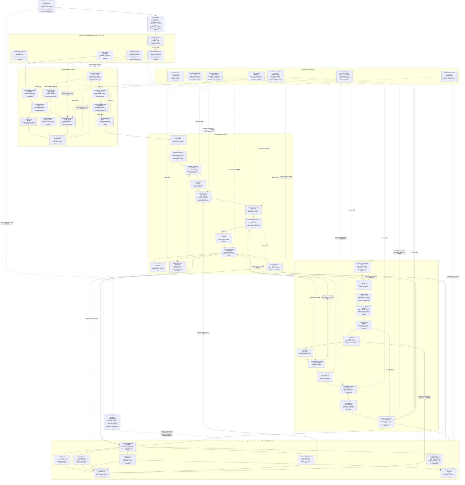

# WorldEngine System Architecture Flowchart

Status: target architecture planning artifact

This diagram describes the most reasonable target flow for WorldEngine without
treating the current codebase as the implementation source of truth. It keeps
the core product model focused on three primary modules:

- World Generation
- World Runtime
- Agent Runtime

Event contracts, state/diff/snapshot contracts, memory/evidence, persistence,
projection, and validation are shared infrastructure around those three
modules. Godot and other engines are projection clients, not core dependencies.

Mermaid source-only copy: `docs/system-architecture-flowchart.mmd`.

